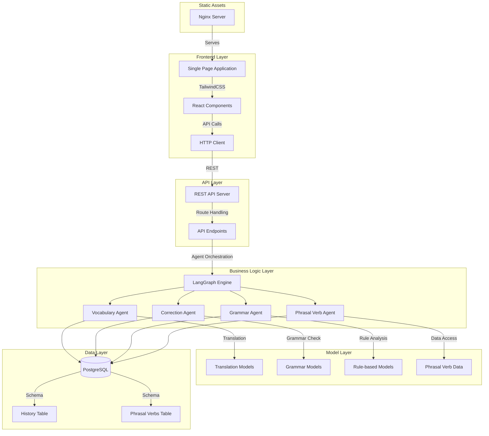

# Design Document

## Overview

The English Assistant is a full-stack web application designed as a local learning platform for Spanish speakers improving their English skills. The system follows a three-tier architecture with a JavaScript/TailwindCSS frontend, a Python-based LangGraph backend with REST API, and PostgreSQL for data persistence. All AI processing occurs offline using HuggingFace models, ensuring complete privacy and independence from external services.

## Architecture

### System Architecture Diagram



### Technology Stack

- **Frontend**: Vanilla JavaScript with TailwindCSS, optional React for complex components
- **Backend**: Python with LangGraph framework for agent orchestration
- **API**: REST endpoints using FastAPI or Flask
- **Database**: PostgreSQL for persistent storage
- **AI Models**: HuggingFace Transformers (offline mode)
- **Deployment**: Nginx for static file serving, Python server for API

## Components and Interfaces

### Frontend Components

#### Core UI Components
- **NavigationBar**: Main navigation between sections (Home, Vocabulary, Writing, Grammar, Phrasal Verbs, History)
- **InputResponseLayout**: Reusable component for query input and result display
- **HistoryPanel**: Searchable history with edit/reopen functionality
- **PhrasalVerbTable**: Sortable/filterable table with progress tracking
- **StatusBadge**: Visual indicators for difficulty levels and progress status

#### Page Components
- **HomePage**: Landing page with feature overview and quick access
- **VocabularyPage**: Word/sentence explanation interface
- **WritingCorrectionPage**: Text correction with before/after comparison
- **GrammarPage**: Grammar questions and word comparison interface
- **PhrasalVerbsPage**: Interactive phrasal verb learning table
- **HistoryPage**: Comprehensive history management interface

### Backend Components

#### LangGraph Agents

**VocabularyAgent**
```python
class VocabularyAgent:
    def __init__(self):
        self.translation_models = [
            "facebook/nllb-200-distilled-600M",
            "Helsinki-NLP/opus-mt-es-en", 
            "facebook/m2m100_418M"
        ]
    
    def explain_vocabulary(self, query: str) -> VocabularyResponse:
        # Process vocabulary explanation using translation models
        pass
```

**CorrectionAgent**
```python
class CorrectionAgent:
    def __init__(self):
        self.grammar_model = "vennify/t5-base-grammar-correction"
        self.language_tool = LanguageTool('en-US')
    
    def correct_text(self, text: str) -> CorrectionResponse:
        # Perform grammar correction and generate explanations
        pass
```

**GrammarAgent**
```python
class GrammarAgent:
    def __init__(self):
        self.rule_engine = LanguageTool('en-US')
    
    def explain_grammar(self, question: str) -> GrammarResponse:
        # Provide grammar explanations and word comparisons
        pass
```

**PhrasalVerbAgent**
```python
class PhrasalVerbAgent:
    def __init__(self):
        self.phrasal_verb_db = PhrasalVerbDatabase()
    
    def get_phrasal_verbs(self, filters: dict) -> List[PhrasalVerb]:
        # Retrieve and filter phrasal verbs with progress tracking
        pass
```

#### API Endpoints

**REST API Structure**
```python
# FastAPI application structure
app = FastAPI()

@app.post("/api/vocabulary")
async def vocabulary_explanation(request: VocabularyRequest):
    # Route to VocabularyAgent
    pass

@app.post("/api/correction") 
async def writing_correction(request: CorrectionRequest):
    # Route to CorrectionAgent
    pass

@app.post("/api/grammar")
async def grammar_explanation(request: GrammarRequest):
    # Route to GrammarAgent
    pass

@app.get("/api/phrasal-verbs")
async def get_phrasal_verbs(filters: PhrasalVerbFilters):
    # Route to PhrasalVerbAgent
    pass

@app.get("/api/history")
async def get_history(section: str = None, search: str = None):
    # Retrieve filtered history
    pass
```

## Data Models

### Database Schema

```sql
-- Main history table for all interactions
CREATE TABLE history (
    id SERIAL PRIMARY KEY,
    section VARCHAR(50) NOT NULL,
    query TEXT NOT NULL,
    result TEXT NOT NULL,
    explanation TEXT,
    examples TEXT[],
    tags TEXT[],
    created_at TIMESTAMP DEFAULT NOW(),
    updated_at TIMESTAMP DEFAULT NOW()
);

-- Phrasal verbs with progress tracking
CREATE TABLE phrasal_verbs (
    id SERIAL PRIMARY KEY,
    verb TEXT NOT NULL,
    definition TEXT NOT NULL,
    examples TEXT[],
    difficulty VARCHAR(20) DEFAULT 'beginner',
    status VARCHAR(20) DEFAULT 'pending',
    user_progress JSONB,
    created_at TIMESTAMP DEFAULT NOW(),
    updated_at TIMESTAMP DEFAULT NOW()
);

-- Indexes for performance
CREATE INDEX idx_history_section ON history(section);
CREATE INDEX idx_history_created_at ON history(created_at);
CREATE INDEX idx_history_tags ON history USING GIN(tags);
CREATE INDEX idx_phrasal_verbs_difficulty ON phrasal_verbs(difficulty);
CREATE INDEX idx_phrasal_verbs_status ON phrasal_verbs(status);
```

### API Response Models

```python
from pydantic import BaseModel
from typing import List, Optional

class BaseResponse(BaseModel):
    query: str
    result: str
    explanation: Optional[str] = None
    examples: List[str] = []
    tags: List[str] = []

class VocabularyResponse(BaseResponse):
    translations: dict
    language_detected: str

class CorrectionResponse(BaseResponse):
    original_text: str
    corrected_text: str
    corrections: List[dict]
    grammar_rules: List[str]

class GrammarResponse(BaseResponse):
    rule_category: str
    related_concepts: List[str]

class PhrasalVerb(BaseModel):
    id: int
    verb: str
    definition: str
    examples: List[str]
    difficulty: str
    status: str
    progress: dict
```

## Error Handling

### Frontend Error Handling
- **Network Errors**: Display user-friendly messages for API connectivity issues
- **Validation Errors**: Real-time input validation with clear error messages
- **Loading States**: Progress indicators during API calls
- **Fallback UI**: Graceful degradation when features are unavailable

### Backend Error Handling
- **Model Loading Errors**: Graceful fallback to alternative models
- **Database Connection Errors**: Retry logic with exponential backoff
- **Input Validation**: Comprehensive request validation with detailed error responses
- **Rate Limiting**: Protection against excessive requests

### Error Response Format
```python
class ErrorResponse(BaseModel):
    error: str
    message: str
    details: Optional[dict] = None
    timestamp: str
    request_id: str
```

## Testing Strategy

### Frontend Testing
- **Unit Tests**: Component logic testing with Jest
- **Integration Tests**: API integration testing
- **E2E Tests**: User workflow testing with Playwright
- **Accessibility Tests**: WCAG compliance validation

### Backend Testing
- **Unit Tests**: Individual agent functionality testing
- **Integration Tests**: Database and model integration testing
- **API Tests**: Endpoint functionality and response validation
- **Performance Tests**: Model loading and response time testing

### Test Data Management
- **Mock Data**: Predefined test queries and expected responses
- **Database Fixtures**: Test database setup and teardown
- **Model Mocking**: Lightweight model substitutes for testing

## Performance Considerations

### Model Optimization
- **Model Caching**: Keep models loaded in memory for faster responses
- **Lazy Loading**: Load models only when needed to reduce startup time
- **Model Quantization**: Use optimized model versions for CPU inference

### Database Optimization
- **Connection Pooling**: Efficient database connection management
- **Query Optimization**: Indexed queries for history and phrasal verb searches
- **Data Archiving**: Periodic cleanup of old history entries

### Frontend Optimization
- **Code Splitting**: Load components on demand
- **Asset Optimization**: Minified CSS and JavaScript
- **Caching Strategy**: Browser caching for static assets and API responses

## Security Considerations

### Data Privacy
- **Local Storage**: All data remains on user's machine
- **No External APIs**: Complete offline operation
- **Data Encryption**: Optional database encryption for sensitive data

### Input Validation
- **SQL Injection Prevention**: Parameterized queries
- **XSS Protection**: Input sanitization and output encoding
- **CSRF Protection**: Token-based request validation

### Access Control
- **Local Access Only**: API accessible only from localhost
- **Rate Limiting**: Prevent abuse of computational resources
- **Input Size Limits**: Prevent memory exhaustion attacks